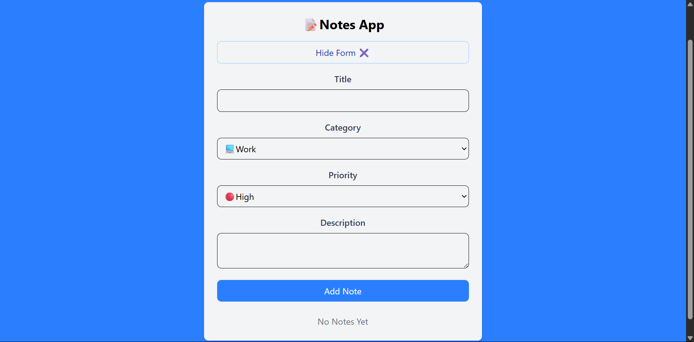
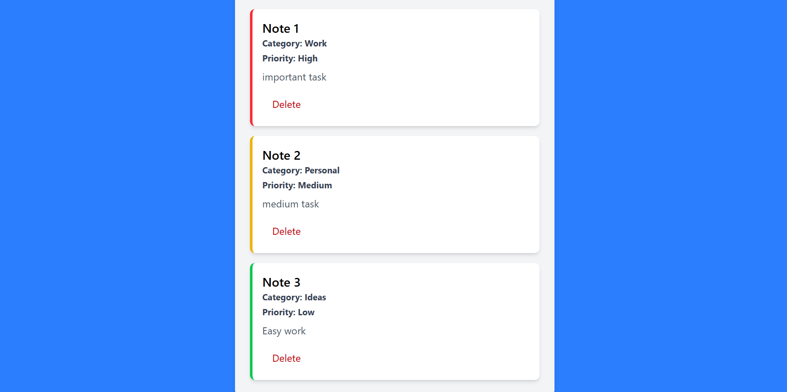

# React Notes App

A simple, fast, and responsive note-taking application built with **React** and **Tailwind CSS**.  
It allows users to create, edit, and delete notes, with all data stored locally in the browser.

## ✨ Features
- 📝 Create notes instantly
- 🗑️ Delete notes
- 📱 Fully responsive design

## 🛠️ Tech Stack
- **React** – Frontend framework
- **Tailwind CSS** – Styling


## 📷 Screenshots



## 🚀 Installation & Setup
1. Clone the repository:
   ```bash
   git clone https://github.com/yourusername/react-notes-app.git
Navigate into the project folder:

bash
Copy
Edit
cd react-notes-app
Install dependencies:

bash
Copy
Edit
npm install
Start the development server:

bash
Copy
Edit
npm run dev
Open your browser at:

arduino
Copy
Edit
http://localhost:5173
📌 Usage
Click "Add Note" to create a new note

Select a note to edit it

Use the delete button to remove notes

📜 License
This project is open-source and available under the MIT License.

yaml
Copy
Edit

---

If you want, I can also **rewrite this README in a “showcase” style** so it looks more professional for Upwork and recruiters.  
Do you want me to make that version too?